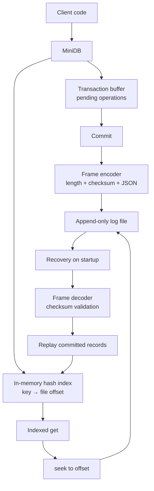
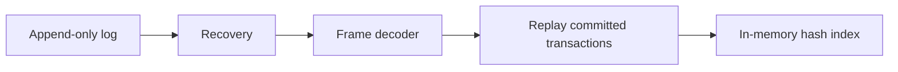

</> Markdown

# MiniDb

A Tiny persistent key-value storage engine written in Python.

##Architecture

```mermaid
flowchart TD
    Client[Client code] --> DB[MiniDB]

    DB --> Tx[Transaction buffer<br/>pending operations]
    DB --> Index[In-memory hash index<br/>key → file offset]

    Tx --> Commit[Commit]
    Commit --> Encoder[Frame encoder<br/>length + checksum + JSON]
    Encoder --> Log[Append-only log file]

    Log --> Recovery[Recovery on startup]
    Recovery --> Decoder[Frame decoder<br/>checksum validation]
    Decoder --> Replay[Replay committed records]
    Replay --> Index

    Index --> Get[Indexed get]
    Get --> Seek["seek to offset"]
    Seek --> Log
```

### Write path

```mermaid
flowchart LR
    Client["Client code"] --> DB["MiniDB"]
    DB --> Tx["Transaction buffer"]
    Tx --> Commit["Commit"]
    Commit --> Encoder["Frame encoder"]
    Encoder --> Log["Append-only log"]
```
### Recovery path

```mermaid
flowchart LR
    Log["Append-only log"] --> Recovery["Recovery"]
    Recovery --> Decoder["Frame decoder"]
    Decoder --> Replay["Replay committed transactions"]
    Replay --> Index["In-memory hash index"]
```

### Read path

```mermaid
flowchart LR
    Client["Client code"] --> DB["MiniDB"]
    DB --> Index["Hash index"]
    Index --> Seek["Seek to offset"]
    Seek --> Log["Log file"]
    Log --> Frame["Read one frame"]
    Frame --> Value["Return value"]
```